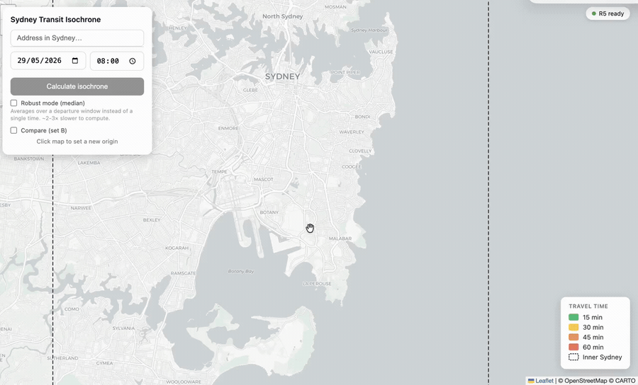

# Sydney Transit Isochrone Map

**Generate transit isochrone maps for inner Sydney — see how far you can travel by public transport in 15, 30, 45, or 60 minutes.**



---

## What It Does

Pick any address in inner Sydney and the app draws concentric zones showing every place reachable by public transit + walking within each time cutoff. Each zone comes with:

- **Surface area** in km²
- **POI counts** — supermarkets, parks, restaurants & cafés within each band
- **Click-to-route** — click anywhere inside an isochrone to get a detailed itinerary (legs, modes, transfers, walking/waiting/riding breakdown)
- **Robust mode** — computes the median over a 30-minute departure window so results reflect typical service, not just a lucky connection
- **A/B comparison** — overlay two origins (or two departure time presets) side by side

---

## Features

- Isochrones at 15 / 30 / 45 / 60 min cutoffs, all computed in one request
- Insights panel per band: area km², supermarkets, parks, restaurants/cafés
- Detailed itinerary on map click: each leg with mode, line, duration, wait time, transfers
- Robust mode (median percentile over configurable departure window)
- Side-by-side A/B comparison of two origins or time presets
- Dashed rectangle overlay showing the inner Sydney coverage bbox
- Geocoding via Nominatim (type an address or click the map)
- Zero frontend dependencies — vanilla JS + Leaflet

---

## Architecture / Stack

```
nginx (port 3000)
  ├── /         → serves app/ (static HTML + JS)
  └── /api/     → proxies to r5:8000

r5 container
  ├── FastAPI (uvicorn, port 8000)
  ├── r5py — Python bindings for Conveyal R5
  └── R5 jar (JVM, eclipse-temurin 21)

Data (mounted at /data)
  ├── sydney.osm.pbf      OSM Greater Sydney (~52 MB, BBBike)
  └── gtfs-sydney.zip     GTFS TfNSW filtered to inner Sydney (~102 MB)
```

- **Routing engine**: [Conveyal R5](https://github.com/conveyal/r5) via [r5py](https://r5py.readthedocs.io/)
- **Backend**: FastAPI + Python
- **Frontend**: Vanilla JS + [Leaflet](https://leafletjs.com/), zero npm
- **Map tiles**: CARTO (Voyager)
- **Geocoding**: Nominatim / OpenStreetMap

---

## Why R5?

OpenTripPlanner 2.x removed its analyst/isochrone API (the "batch analyst" was deprecated in OTP 2.0 and spun out into Conveyal's R5). OTP 2.x only supports point-to-point routing, not area reachability queries.

This project uses **Conveyal R5 via r5py** — the purpose-built engine for transit isochrones. It consumes the same inputs (OSM `.pbf` + GTFS `.zip`) and runs inside Docker alongside the nginx frontend.

---

## Prerequisites

- **Docker** and **Docker Compose** (v2)
- **Transport for NSW API key** (free) — register at [opendata.transport.nsw.gov.au](https://opendata.transport.nsw.gov.au), create an app, and copy the API key
- **~7 GB RAM** available for Docker (R5 uses 6 GB by default)

---

## Installation

```bash
git clone https://github.com/adrienbeton/sydneymap.git
cd sydneymap

# Create .env with your TfNSW API key
echo "TFNSW_API_KEY=your_key_here" > .env

# Bootstrap everything
./scripts/bootstrap.sh
```

The bootstrap script handles the full setup in order:

1. Downloads OSM Greater Sydney extract from BBBike (~52 MB) — skipped if already present
2. Downloads the complete TfNSW GTFS feed via the Open Data API (~293 MB compressed)
3. Filters GTFS to inner Sydney bbox, producing `data/gtfs-sydney.zip` (~102 MB)
4. Builds the Docker image (R5 jar + r5py + FastAPI)
5. Starts both containers; R5 builds the transport network in memory (~1–2 min)
6. Opens http://localhost:3000 once the network is ready

**Note**: `data/` and `.env` are gitignored — no large files or secrets are committed.

### Subsequent starts (network already built)

```bash
docker compose up -d
```

The network is rebuilt from `data/` on every container start (~1–2 min); there is no persisted graph file.

---

## Usage

1. **Enter an address** in the search box or click directly on the map to set the origin
2. **Choose a date and time** for the departure
3. **Click "Calculate"** — isochrone bands appear in ~7 s
4. **Read the insights panel** — area and POI counts per band
5. **Click anywhere inside an isochrone** to fetch a detailed itinerary to that point
6. **Toggle "Robust mode"** to get the median isochrone over a 30-minute departure window (slower but more representative)
7. **Use A/B comparison** to overlay two origins or compare morning vs. evening service using the time presets

---

## API Reference

The R5 container exposes three endpoints (proxied by nginx under `/api/`).

### `GET /api/isochrone`

| Parameter | Type | Default | Description |
|-----------|------|---------|-------------|
| `lat` | float | required | Origin latitude |
| `lon` | float | required | Origin longitude |
| `date` | string | required | `YYYY-MM-DD` — must fall within GTFS service dates |
| `time` | string | required | `HH:MM` departure time |
| `cutoffs` | string | `15,30,45,60` | Comma-separated cutoff minutes |
| `modes` | string | `TRANSIT,WALK` | Comma-separated modes: `TRANSIT`, `WALK`, `BUS`, `RAIL`, `FERRY`, `TRAM`, `SUBWAY` |
| `robust` | bool | `false` | If true, uses median over departure window |

Returns a GeoJSON `FeatureCollection`. Each feature is a filled polygon for one cutoff, with properties:

```json
{
  "cutoffMinutes": 30,
  "area_km2": 42.5,
  "pois": {
    "supermarkets": 14,
    "parks": 23,
    "restaurants_cafes": 187
  }
}
```

### `GET /api/itinerary`

| Parameter | Type | Description |
|-----------|------|-------------|
| `lat`, `lon` | float | Origin |
| `toLat`, `toLon` | float | Destination |
| `date`, `time` | string | Departure (same format as above) |
| `modes` | string | Transport modes |

Returns `{ "summary": { "total_min", "walk_min", "wait_min", "in_vehicle_min", "transfers" }, "legs": [...] }`.

### `GET /api/health`

Returns `{"status": "UP"}` once the transport network has finished loading. The frontend polls this on startup.

---

## Configuration

Environment variables (set in `docker-compose.yml` or a `.env` file):

| Variable | Default | Effect |
|----------|---------|--------|
| `R5_MAX_MEMORY` | `6G` | JVM heap for R5. Increase if OOM; decrease on memory-constrained hosts. |
| `GRID_RESOLUTION` | `100` | Point grid resolution in metres. Lower = more precise polygons, slower (~4× at 50 m). |
| `CROP_BUFFER_KM` | `3` | Buffer added around the inner Sydney bbox when cropping OSM for R5. Larger = better routing near the edges. |
| `ROBUST_WINDOW_MIN` | `30` | Departure window (minutes) used for robust/median isochrone computation. |

Also `mem_limit: 7g` in `docker-compose.yml` should be ~1 GB above `R5_MAX_MEMORY`.

---

## Coverage & Limitations

Coverage is defined by the **inner Sydney bbox**:

```
North : -33.75  (Chatswood / Manly)
South : -34.05  (Ramsgate / La Perouse)
West  : 151.05  (Henley / Kogarah)
East  : 151.35  (coast)
```

The dashed rectangle on the map shows this boundary. Isochrones are cropped at the bbox + `CROP_BUFFER_KM` buffer — origins outside this area will produce incomplete results.

The GTFS feed covers inner Sydney transit only. The `date` parameter must fall within the active service calendar of the downloaded GTFS — use a date within the next few weeks for best results.

---

## Updating Timetables

TfNSW publishes new GTFS timetables periodically. To refresh:

```bash
rm data/gtfs-sydney.zip
./scripts/bootstrap.sh
```

This re-downloads and re-filters the feed. OSM data does not need to be re-downloaded unless the road network has changed significantly.

---

## Project Structure

```
app/
  index.html              Frontend — Leaflet map, geocoding, isochrone display, itinerary panel
r5/
  Dockerfile              eclipse-temurin 21 + Python + r5py + R5 jar
  server.py               FastAPI app: network loading, /isochrone, /itinerary, /health
  insights.py             POI indexing, area calculation, itinerary summarisation
  requirements.txt        r5py, fastapi, uvicorn, geopandas, shapely, osmium
scripts/
  bootstrap.sh            Full setup: download → filter → build → start
  filter-gtfs.py          Filters full NSW GTFS to inner Sydney bbox
docker-compose.yml        r5 (internal :8000) + nginx (:3000)
nginx.conf                /api/ proxy + static file serving
.env                      TFNSW_API_KEY (gitignored)
data/                     OSM + GTFS files (gitignored, generated by bootstrap)
```

---

## Data Sources & Attribution

| Source | Used for |
|--------|----------|
| [OpenStreetMap](https://www.openstreetmap.org/) via [BBBike extract](https://download.bbbike.org/osm/bbbike/Sydney/) | Road network + POI data (ODbL) |
| [Transport for NSW Open Data — Complete GTFS](https://opendata.transport.nsw.gov.au/dataset/timetables-complete-gtfs) | Transit timetables — see respective licenses |
| [Conveyal R5](https://github.com/conveyal/r5) + [r5py](https://github.com/r5py/r5py) | Transit routing engine — see respective licenses |
| [Leaflet](https://leafletjs.com/) | Map rendering (BSD 2-Clause) |
| [CARTO Voyager](https://carto.com/basemaps/) | Map tiles — see CARTO terms |
| [Nominatim](https://nominatim.org/) | Address geocoding (ODbL) — please respect the [usage policy](https://operations.osmfoundation.org/policies/nominatim/) (1 req/s, no bulk geocoding) |

---

## License

Released under the [MIT License](LICENSE).
